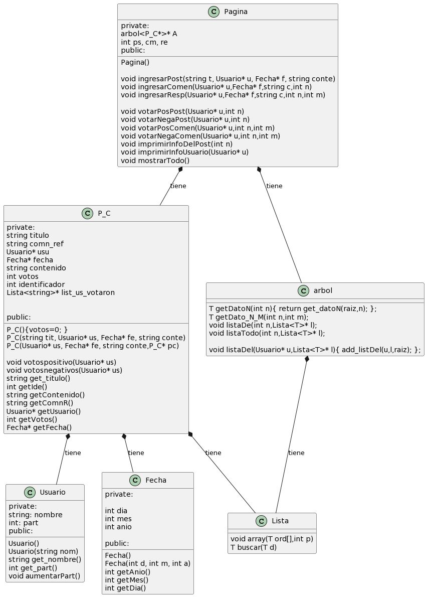

---
# ALGORITMO Y ESTRUCTURA DE DATOS


## SEGUNDO PARCIAL 2023

---
### INTEGRANTES:
* GIMÉNEZ, ALEXIS BRIAN
* CRUZ, JUAN
* REYEROS, MARCOS AGUSTÍN
* VÁSQUEZ, MATIAS JAIR ELIAN

---

### PROFESORES:
* Wolfmann, Gustavo
* Ayme, Rubén

---
## ENUNCIADO:
Dado que el sitio de foros “Reddit” es ampliamente utilizado por personas del mundo de la
tecnología, en la cátedra de Algoritmos y Estructuras de Datos decidimos implementar
nuestra propia versión utilizando C++ para guardar los datos de las publicaciones y
comentarios.

El software debe permitir crear nuevos Posts con título, nombre de usuario, fecha de
creación, contenido y además cada post se puede votar positiva o negativamente (tendrá
asociado un valor positivo o negativo de acuerdo a las valoraciones de los participantes).

Cada Post puede ser comentado por cualquier usuario N cantidad de veces y a su vez cada
comentario puede ser también respondido N cantidad de veces por cualquier usuario.

Usted debe desarrollar el código que permita almacenar los Posts utilizando árboles
N-arios.

Los Árboles N-arios a utilizar se basaran en árboles binarios con una forma particular de
crear sus dos ramas. En el Anexo al final del documento se puede ver un ejemplo de cómo
algunos posts con sus comentarios y respuestas se representan en un árbol binario.

La solución implementada debe:
* Tener mecanismos para crear nuevos Posts.
* Tener mecanismos para comentar y responder.
* Tener mecanismos para borrar un Post y todos sus comentarios asociados.
* Implementar mecanismos para votar positiva o negativamente un Post/comentario.
* Implementar un mecanismo para imprimir información de un Post:
    * Comentario más votado.
    * Usuario que más participó.
    * Valoración promedio (por ejemplo: sumatoria de votos)
* Imprimir todos los posts con sus comentarios.
* Mostrar todas las participaciones que tuvo un usuario en los diferentes posts,
ordenadas por fecha del comentario.

---
## DESARROLO CODIGO EN REPLIT:
[CODIGO - HACER CLICK AQUI](https://replit.com/@BRAIAN-ALEXISA1/TP2-Algoritmos-Y-Estructuras-de-Datos#main.cpp)

---
## DIAGRAMA UML


---
### **CLASE USUARIO**

```c++
class Usuario{
private:
  string nombre;
  int part;
public:
  Usuario(){}
  Usuario(string nom){nombre=nom;part=1; };
  string get_nombre();
  int get_part(){ return part; };
  void aumentarPart(){ part=part+1;}

  bool operator==(Usuario& other){ return get_nombre() == other.get_nombre() ;};
  friend ostream& operator<<(ostream& out,Usuario& other);
  bool operator>(Usuario& other){ return get_part() > other.get_part() ;};

};

ostream& operator<<(ostream& out,Usuario& other){
  out<<"El usuario "<<other.get_nombre()<<" con una participacion de "<<other.get_part();
  out<<endl;
  return out;
}

string Usuario::get_nombre()
{
  int largo = nombre.size(); 
  for (int letra = 0; letra < largo; ++letra) {
     nombre[letra] = tolower(nombre[letra]); 
  }
    return nombre; 
}


```

Representa objetos de tipo usuario que guarda un atributo de tipo String  que guarda el nombre del usuario y un entero que guarda las participaciones que tuvo un usuario en diferentes posteos.

Tambien contempla sobrecargas de operador para saber cuando un usuario es igual, un usuario es mayor que otro y una sobrecarga del operador para imprimir el usuario.

---
### **CLASE FECHA**
```c++

class Fecha{
private:

  int dia;
  int mes;
  int anio;

public:
  Fecha(){}
  Fecha(int d, int m, int a);
  int getAnio(){return anio;}
  int getMes(){return mes;}
  int getDia(){return dia;}

  bool operator<(Fecha& other);

};

Fecha::Fecha(int d,int m, int a)
{
  if(d>0 && d<32)dia=d;
  if(m>0 && m<13)mes=m;
  if(a>0)anio=a;
}


bool Fecha::operator<(Fecha& other)
{
  if(getAnio() < other.getAnio() ){ return true;}
  else{
    if(getAnio() > other.getAnio()){ return false;}
    else{
      if(getMes() < other.getMes() ){ return true;}
      else{
        if(getMes() > other.getMes() ){ return false;}
        else{
          if(getDia() <= other.getDia()){ return true;}
          else return false;
        }
      }
    }
  }
}

```

Representa objetos de tipo FECHA que tienen como atributos dia, mes y año con sus distintos getters y una sobrecarga de operador de para verificar si una fecha es menor que otra  cuales son posterioremente muestra las participaciones de un usuario ordenada por fecha POSTs.


---
### **CLASE NODO Y LISTA**

```C++
template <class T> class Nodo {
private:
    T dato;
    Nodo* next;
public:
    Nodo() { next = NULL; };
    Nodo(T a) { dato = a; next = NULL; };
    void set_dato(T a) { dato = a; };
    void set_next(Nodo* n) { next = n; };
    T get_dato() { return dato; };
    Nodo* get_next() { return next; };
    bool es_vacio() { return next == NULL; }
};

template <class T> class Lista {
private: Nodo<T>* czo;
       void addO(T d, Nodo<T>* ant);
       void borrarD(T d, Nodo<T>* ant);
public:
    Lista() { czo = new Nodo<T>(); };
    Lista(Nodo<T>* n) { czo = n; };
    //~Lista(void);
    void add(T d); //sumar nodos a la lista
    bool esvacia(void);
    T cabeza(void); //retorna el dato del primer nodo
    Lista* resto(void); //retorna el puntero al "resto" de la lista
                        //resto= lo que queda de la lista sin la cabeza
    string toPrint(string p);
    void impre(void);
    T suma(T i);
    int size();
    bool esta(T d);// detecta si d esta en la lista
    void borrarDato(T d) { borrarD(d, NULL); }//borra el nodo que contiene d
    void borrar(void); //borra la cabeza
    void borrar_last();//borra el ultimo
    void concat(Lista<T>* l1);// le transfiere los datos de l1 a this
    Lista<T>* copy(void);// hace una copia de la lista
    void tomar(int n);//deja "vivos" los n primeros nodos y borra el resto
    void addOrdenado(T d) { addO(d, NULL); }; //sumar nodos a la lista Ordenados de menor a MAYOR
    void array(T ord[],int p);
    T buscar(T d);

};


template <class T> void Lista<T>::array(T ord[], int p)
{
  if(!esvacia())
  {
    ord[p]=this->cabeza();
    this->resto()->array(ord,p+1);
  }

}


template <class T>
void Lista<T>::add(T d) //100
{
    Nodo<T>* nuevo = new Nodo<T>(d);
    nuevo->set_next(czo);
    czo = nuevo;
}
template <class T>
bool Lista<T>::esvacia(void)
{
    return czo->es_vacio();
}
template <class T>
T Lista<T>::cabeza(void)
{
    if (this->esvacia()) {
        cout << " Error, Cabeza de lista vacia";
      //  return NULL;
    }
    return czo->get_dato();
}

template <class T>
Lista<T>* Lista<T>::resto(void)
{
    Lista* l = new Lista(czo->get_next());
    return (l);
}

template <class T>
string Lista<T>::toPrint(string p)
{
    if (this->esvacia()) {
        return p;
    }
    else {
        //std::ostringstream stm;
        ostringstream stm;
        stm << this->cabeza() << "-" << this->resto()->toPrint(p) << endl;
        //cout<<endl<<" stm.str()= "<<stm.str()<<endl;
        return stm.str();
    }
}

template <class T>
T Lista<T>::suma(T i)
{    //cout<<" i al entrar= "<<i<<endl;
    if (this->esvacia()) {
        return i;
    }
    else {

        //cout<<"this->cabeza()= "<<this->cabeza()<<endl;   
        return this->resto()->suma(i + this->cabeza());
    }
}

template <class T> int Lista<T>::size()
{
    if (this->esvacia()) return 0;
    return 1 + this->resto()->size();
}

template <class T> void Lista<T>::borrar(void)
{ //borra el nodo cabeza
    if (!this->esvacia()) {
        Nodo<T>* tmp = czo;
        czo = czo->get_next();
        delete tmp;
    }
}

template <class T> void Lista<T>::borrar_last()
{ // borra el ultimo nodo
    if (!this->esvacia()) {
        if ((czo->get_next())->get_next() == NULL) {
            delete czo->get_next();
            czo->set_next(NULL);
        }
        else this->resto()->borrar_last();
    }
}

template <class T> void Lista<T>::concat(Lista<T>* l1)
{// le transfiere los datos de l1 a this
    if (!(l1->esvacia())) {
        this->concat(l1->resto());
        this->add(l1->cabeza());
    }
}

template <class T> Lista<T>* Lista<T>::copy(void)
{
    Lista<T>* aux = new Lista();
    aux->concat(this);
    return aux;
}

template <class T> void Lista<T>::tomar(int n)
{ //deja "vivos" los n primeros nodos y borra el resto
    if (this->size() > n) {
        this->borrar_last();
        this->tomar(n);
    }
}

template <class T> void Lista<T>::impre(void)
{
    Nodo<T>* aux;
    aux = czo;
    while (aux->get_next() != NULL) {
        cout << *aux->get_dato() << endl;
        aux = aux->get_next();
    }
}

template <class T> void Lista<T>::addO(T d, Nodo<T>* ant)
{
    if (this->esvacia()) {//el primero
        this->add(d);
    }
    else {
        if (d < czo->get_dato()) {
            if (ant == NULL) {//al principio
                this->add(d);
            }
            else {//entre medio
                Nodo<T>* nuevo = new Nodo<T>(d);
                nuevo->set_next(ant->get_next());
                ant->set_next(nuevo);
            }
        }
        else {
            if ((czo->get_next())->get_next() == NULL) {//al final
                Nodo<T>* nuevo = new Nodo<T>(d);
                nuevo->set_next(czo->get_next());
                czo->set_next(nuevo);

            }
            else this->resto()->addO(d, czo);

        }
    }
}

template <class T> bool Lista<T>::esta(T d)
{// busca d en la lista
    if (this->esvacia()) return false;
    if (this->cabeza() == d) return true;
    
    return this->resto()->esta(d);    
}


template <class T> T Lista<T>::buscar(T d)
{// busca d en la lista
    T b;
    if (this->esvacia()) return b;
    if (this->cabeza() == d) return b;
    
    return this->resto()->esta(d);    
}

template <class T> void Lista<T>::borrarD(T d, Nodo<T>* ant)
{
    if (!this->esvacia()) {
        if (d == this->cabeza()) {
            if (ant == NULL) {//al principio
                this->borrar();
            }
            else {//entre medio
                ant->set_next(czo->get_next());
                delete czo;
            }
        }
        else  this->resto()->borrarD(d, czo);

    }
}


```

Estas clases fueron sacadas del aula virtual pero se les agrego un metodo llamado array que recibe un arreglo y lo va completando desde la posicion 0 en adelante con los datos de la lista.

---

### **CLASE P_C**

```C++
class P_C{
  private:
    string titulo;
    string comn_ref;
    Usuario* usu;
    Fecha* fecha;
    string contenido;
    int votos;
    int identificador;
    Lista<string>* list_us_votaron;
    

  public:

    P_C(){votos=0; };
    P_C(string tit, Usuario* us, Fecha* fe, string conte);
    P_C(Usuario* us, Fecha* fe, string conte,P_C* pc);

    void votospositivo(Usuario* us);
    void votosnegativos(Usuario* us);
    string get_titulo(){ return titulo; };
    int getIde(){return identificador;};
    string getContenido(){ return contenido; };
    string getComnR(){ return comn_ref; };
    Usuario* getUsuario(){ return usu; };
    int getVotos(){ return votos; };
    Fecha* getFecha(){ return fecha; };  

    bool operator<(P_C& other);
    bool operator==(P_C& other){ return getContenido() == other.getContenido() ;};
    bool operator==(Usuario& other){ return *getUsuario() == other ;};
    bool operator>(P_C& other){ return getVotos() > other.getVotos() ;};
    bool operator<=(P_C& other){ return *getFecha() < *other.getFecha() ;};  

    friend ostream& operator<<(ostream& out,P_C& p_c);


    
       
};

ostream& operator<<(ostream& out,P_C& p_c)
{
  if(p_c.getIde() == Pos)
  {
    out<<"EL POSTEO"<<endl;
    out<<p_c.getUsuario()->get_nombre()<<" : "<<p_c.get_titulo()<<endl;
    out<<p_c.getContenido()<<endl;
    out<<"Con fecha de: ";
    out<<p_c.fecha->getDia()<<"/";
    out<<p_c.fecha->getMes()<<"/";
    out<<p_c.fecha->getAnio()<<endl;
    return out;
    
  }else{
    if(p_c.getIde() == Come)
    {
      out<<"EL COMENTARIO"<<endl;
      out<<p_c.getUsuario()->get_nombre()<<" : "<<p_c.getContenido()<<endl;
      out<<"Con fecha de: ";
      out<<p_c.fecha->getDia()<<"/";
      out<<p_c.fecha->getMes()<<"/";
      out<<p_c.fecha->getAnio()<<endl;
      return out;
      
    }else{
      out<<"LA RESPUESTA"<<endl;
      out<<p_c.getUsuario()->get_nombre()<<" : "<<p_c.getContenido()<<endl;
      out<<"Con fecha de: ";
      out<<p_c.fecha->getDia()<<"/";
      out<<p_c.fecha->getMes()<<"/";
      out<<p_c.fecha->getAnio()<<endl;
      return out;
    }
  }
}


bool P_C::operator<(P_C& other){
  
  if(this->getIde() == Pos && other.getIde()==Pos){
    return false;
  }
  
  if(getIde() == Come && other.getIde()==Pos){
    if(get_titulo() == other.get_titulo()){
      return true;
    }else return false;
  }

  if(getIde() == Res && other.getIde()==Pos){
    if(get_titulo() == other.get_titulo()){
      return true;
    }else return false;
  }else{
    if(getIde() == Res && other.getIde()==Come){
      if(getComnR() == other.getContenido()){
        return true;
      }else return false;
    }else return false;
  }
}

//Constructor de Posteo
 P_C::P_C(string tit, Usuario* us, Fecha* fe, string conte){
   
   titulo=tit;
   usu=us;
   fecha=fe;
   votos=0;
   contenido=conte;
   identificador=Pos;
   
   Lista<string>* l= new Lista<string>();
   list_us_votaron= l;
   
 };

//constructor de comentario o respuesta
P_C::P_C(Usuario* us, Fecha* fe, string conte, P_C* p_c){
  
   usu=us;
   fecha=fe;
   votos=0;
   contenido=conte;
  if(p_c->getIde() == 2){
    identificador=Res;
    titulo=p_c->get_titulo();
    comn_ref=p_c->getContenido();
  }else{
    identificador=Come;
    titulo=p_c->get_titulo();
  }
   

  Lista<string>* l= new Lista<string>();
  list_us_votaron= l;
  
};


void P_C::votospositivo(Usuario* us){
  
  if(!list_us_votaron->esta(us->get_nombre())) {
    list_us_votaron->add(us->get_nombre());
    votos++;
  }else cout<<"El usuario "<<us->get_nombre()<<" ya voto"<<endl;
  
}


void P_C::votosnegativos(Usuario* us){

  if(!list_us_votaron->esta(us->get_nombre())) {
    list_us_votaron->add(us->get_nombre());
    votos--;
  }else cout<<"El usuario "<<us->get_nombre()<<" ya voto"<<endl;
  
}


```
La clase P_C hace referencia a una publicación la cual puede ser un Posteo, Comentario o una Respuesta.

Sus atributos son un Sterig para el Titulo, un String comn_ref para cuando hay una respuesta, puntero a un usuario, puntero a una fecha, un String para el contenido, un entero para los votos, un entero identificador para ver si es un posteo, comentario o respuesta y una lista de los usuarios que votaron a una publicación.

La calse contempla su respectivo constructor, metodos para votar positiva y negativamente, metodos getters para el identificador, titulo, contenido, usuario, votos y fecha.

Tambien comtemlpa sobrecargas de operador para saber si una publicacion es menor que otra, para saber si una publicacion es igual que otra, si una publicacion es de un respectivo usuario, si una publicacion es mayor que otra y para imprimir la publicación.


---
### **CLASE ARBOL**

```C++
template <class T> class nodo {
public:
    
    T info;
    nodo* der, * izq;
};


template <class T> class arbol {
private:
    nodo<T>* raiz, *q ;
    void ArbolBusq(T x, nodo<T>*& nuevo);
    
    void show(nodo<T>* aux);

    nodo<T>* get_datoNodoN(nodo<T>* aux,int n);
    T get_datoN(nodo<T>* aux,int n);
    T get_datoNM(nodo<T>* aux,int m);

    void add_list(Lista<T>*& l,nodo<T>* aux);
    void add_listT(Lista<T>*& l,nodo<T>* aux);
    void add_listDel(Usuario* u,Lista<T>*& l,nodo<T>* aux);

    void borrar(nodo<T>*& p, T x);
    void bor(nodo<T>*& d);
    void borrarRama(nodo<T>*& b);

    void borrarD(nodo<T>*& pd,T x,nodo<T>*& ant);

    
    bool esta(nodo<T>* aux, T x);

public:

    arbol() { raiz = NULL; };
    ~arbol() {};
    void CreaArbolBus(T x);
    void set_arbolNuevo(){ raiz=NULL; };

    void VerArbol() { show(raiz); };

    void Borrar(T x) { borrar(raiz, x); };
    void BorrarD(T x) { nodo<T>* ant=NULL; borrarD(raiz,x,ant); };

    nodo<T>* get_primeroNodo(){ if(raiz != NULL) return raiz; };
    bool arbolEsVacio(){ return raiz == NULL; };

    T getDatoN(int n){ return get_datoN(raiz,n); };
    T getDato_N_M(int n,int m);
    void listaDe(int n,Lista<T>* l);
    void listaTodo(int n,Lista<T>* l);

    void listaDel(Usuario* u,Lista<T>* l){ add_listDel(u,l,raiz); };
    
    
    bool Esta(T x) { return esta(raiz, x); };
};


template <class T> void arbol<T>::CreaArbolBus(T x)
{
    ArbolBusq(x, raiz);
}
template <class T> void arbol<T>::ArbolBusq(T x, nodo<T>*& nuevo)
{
    if (nuevo == NULL) {
        nuevo = new nodo<T>;
        nuevo->info = x; nuevo->der = nuevo->izq = NULL;
    }else{
      if (*x < *nuevo->info){
      cout<<"Se va a la izquierda"<<endl;
      ArbolBusq(x, nuevo->izq);
      }else{
      cout<<"Se va a la derecha"<<endl;
      ArbolBusq(x, nuevo->der);
      } 
    }
}


template <class T> void arbol<T>::show(nodo<T>* aux)
{
  if(aux != NULL)
  {
    cout<<*aux->info<<endl;
    show(aux->izq);
    show(aux->der);
  }
    
}


template <class T> bool arbol<T>::esta(nodo<T>* aux, T x)
{
  if(aux == NULL) return false;
  if(*x == *aux->info) return true;
  else{
    if(aux == NULL) return false;
    else if (*x < *aux->info) return esta(aux->izq, x);
    else return esta(aux->der,x);
  }
}

//borra un nodo solo reccorriendo la derecha
template <class T> void arbol<T>::borrarD(nodo<T>*& pd,T x,nodo<T>*& ant)
{
  if (pd == NULL) cout << "\n El dato NO esta\n\n";
  else{
    if(*x == *pd->info){// encontre el p/c/r
      nodo<T>* b;
      b=pd;
      if(b->der == NULL){
        if(ant == NULL){
          set_arbolNuevo();
          borrarRama(pd);
        }else{
          ant->der= NULL;
          borrarRama(pd);
        }
      }else{
        if(ant == NULL){
          pd=b->der;
          b->der=NULL;
          borrarRama(b);
        }else{
          ant->der=pd->der;
          b->der=NULL;
          borrarRama(b);
        }
      } 
    }else borrarD(pd->der,x,pd);  
  }
}

//borra un rama entera
template <class T> void arbol<T>::borrarRama(nodo<T>*& b)
{
  if(b != NULL)
  {
    borrarRama(b->izq);
    borrarRama(b->der);
    delete b->info;
    delete b;
  }
}

template <class T> void arbol<T>::borrar(nodo<T>*& p, T x)
{
    if (p == NULL) cout << "\n El dato NO esta\n\n";
    else if (x > p->info) borrar(p->der, x);
    else if (x < p->info) borrar(p->izq, x);
    else {// lo encontre en el nodo p
        q = p;
        if (q->der == NULL) p = q->izq;// raiz<=raiz del subarbol izq
        else if (q->izq == NULL) p = q->der;//raiz<=raiz del subarbol der
        else bor(q->izq);//busca en el sub arbol izq
        delete q;
    }
}
template <class T> void arbol<T>::bor(nodo<T>*& d)
{
    if (d->der != NULL) bor(d->der);//busca el elemento mas a la derecha
    else {
        q->info = d->info;
        q = d;
        d = d->izq;
    }
}


template <class T> nodo<T>* arbol<T>::get_datoNodoN(nodo<T>* aux,int n)
{
  if(aux != NULL)
  {
    if(n > 1){
      return get_datoNodoN(aux->der,n-1);
    }else{
      return aux;
    }
  }else{
    nodo<T>* r=NULL;
    cout<<"Se exedio la posicion del dato"<<endl;
    return r;
  }
}

template <class T> T arbol<T>::get_datoN(nodo<T>* aux,int n)
{
  nodo<T>* ret=get_datoNodoN(aux,n);
  return ret->info;
}


template <class T> T arbol<T>::getDato_N_M(int n, int m)
{
  nodo<T>* aux=get_datoNodoN(raiz,n);
  return get_datoN(aux->izq,m);
}

template <class T> void arbol<T>::listaDe(int n,Lista<T>* l)
{
  nodo<T>* aux=get_datoNodoN(raiz,n);
  add_list(l,aux->izq);

}

template <class T> void arbol<T>::add_list(Lista<T>*& l,nodo<T>* aux)
{
  if(aux != NULL)
  {
    l->add(aux->info);
    add_list(l,aux->der);
  }
}

template <class T> void arbol<T>::listaTodo(int n,Lista<T>* l)
{
  nodo<T>* aux=get_datoNodoN(raiz,n);
  add_listT(l,aux->izq);

}

template <class T> void arbol<T>::add_listT(Lista<T>*& l,nodo<T>* aux)
{
  if(aux != NULL)
  {
    l->add(aux->info);
    add_list(l,aux->der);
    add_list(l,aux->izq);
  }
}


template<class T> void arbol<T>::add_listDel(Usuario* u,Lista<T>*& l,nodo<T>* aux)
{
  if(aux != NULL){
    if(*aux->info == *u)
    {
      l->add(aux->info);
      add_listDel(u,l,aux->der);
      add_listDel(u,l,aux->izq);
    }else{
      add_listDel(u,l,aux->der);
      add_listDel(u,l,aux->izq);
    }
  }
}


```
La calse nodo del arbol es la que se ve en el aula virtual.

Contemplamos un metodo para obtener el UN PUNTERO AL NODO QUE ESTA MAS A LA DERECHA DESDE LA RAIZ, nos sirve para traer un posteo ya que estos siemre pan a estar a la derecha del primer posteo en la estuctura del arbol.

Contemplamos el metodo get_datoNodoN para traer un comentario y un metodo get_datoNM para  traer la respuesta de un comentario.

Tambien esta los metodos list, listT y listDel que lo que hacen es que al pasarle una lsita la rellenan con los comentarios del N posteo, en el otro caso trae la rellena con todos los comentarios y las respuestas, y en el ultimo caso ademas de pasarle un lista les pasamos un usuario con una lista y se llena con todas las publicaciones del ese usuario en el arbol.

---
### **CLASE PAGINA**

```C++

class Pagina {
private:
  arbol<P_C*>* A;
int ps, cm, re;
public:

    Pagina(){ arbol<P_C*>* a=new arbol<P_C*>(); A=a; ps=1; cm=1; re=1; };

    void ingresarPost(string t, Usuario* u, Fecha* f, string conte);
    void ingresarComen(Usuario* u,Fecha* f,string c,int n);
    void ingresarResp(Usuario* u,Fecha* f,string c,int n,int m);

    void votarPosPost(Usuario* u,int n);
    void votarNegaPost(Usuario* u,int n);
    void votarPosComen(Usuario* u,int n,int m);
    void votarNegaComen(Usuario* u,int n,int m);

    void imprimirInfoDelPost(int n);
    void imprimirInfoUsuario(Usuario* u);

    void mostrarTodo(){ if(!A->arbolEsVacio()) A->VerArbol(); };

};


void Pagina::ingresarPost(string t, Usuario* u, Fecha* f, string conte)
{

  
  P_C* p= new P_C(t,u,f,conte);
  A->CreaArbolBus(p);
  cout<<"Se creo el Post "<<ps<<" con titulo: "<<t<<endl;
  ps++;
  
}

void Pagina::ingresarComen( Usuario* u, Fecha* f, string c,int n)
{  
  P_C* aux;
  aux=A->getDatoN(n);
  P_C* comn= new P_C( u, f, c,aux);
  A->CreaArbolBus(comn);
  cout<<"Se creo el Comentario "<<cm<<" con contenido: "<<c<<" para el Post "<<n<<endl;
  cm++;
}

void Pagina::ingresarResp(Usuario* u, Fecha* f, string c,int n,int m)
{
  P_C* aux;
  
  
  aux=A->getDato_N_M(n,m);
  P_C* res= new P_C(u,f,c,aux);
  A->CreaArbolBus(res);
  cout<<"Se creo la Respeuesta "<<re<<" con contenido: "<<c<<" para el comentario "<<n; 
  cout<<" del Post "<<ps<<endl;
  re++;
}

void Pagina::votarPosPost(Usuario* u,int n)
{ 
  P_C* aux=A->getDatoN(n);
  aux->votospositivo(u);
}

void Pagina::votarNegaPost(Usuario* u,int n)
{ 
  P_C* aux=A->getDatoN(n);
  aux->votosnegativos(u);
}

void Pagina::votarPosComen(Usuario* u,int n,int m)
{ 
  P_C* aux=A->getDato_N_M(n,m);
  aux->votospositivo(u);
}

void Pagina::votarNegaComen(Usuario* u,int n,int m)
{ 
  P_C* aux=A->getDato_N_M(n,m);
  aux->votosnegativos(u);
}


void Pagina::imprimirInfoDelPost(int n)
{
  
  Lista<P_C*>* lista= new Lista<P_C*>();
  A->listaDe(n,lista);

  int tam=lista->size();


  P_C* ordenado[tam];

  lista->array(ordenado,0);

  ordenaQS(ordenado,0,tam-1);
  
  cout<<"El comentario con mas votos positivos del Posteo "<<n<<endl;
  cout<<*ordenado[tam-1]<<endl;

  Lista<P_C*>* listaTdo= new Lista<P_C*>();
  A->listaTodo(n,listaTdo);
  Lista<Usuario*>* listUs=new Lista<Usuario*>();
  
  int i=0;
  while(i<listaTdo->size()){
    if(listUs->esta(listaTdo->cabeza()->getUsuario()))
    {
      listaTdo->cabeza()->getUsuario()->aumentarPart();
      listaTdo->borrar();
    }else{
      listUs->add(listaTdo->cabeza()->getUsuario());
      listaTdo->borrar();
    } 
  }

  tam=listUs->size();
  Usuario* ord[tam];
  listUs->array(ord,0);
  
  ordenaQS(ord,0, tam-1);
  
  cout<<"El usuario con mayor participacion es: "<<endl;
  cout<<*ord[tam-1]<<endl;


  Lista<P_C*>* listaVotos= new Lista<P_C*>();
  A->listaTodo(n,listaVotos);

  int cant=listaVotos->size();
  double sum=0;
  while(i<listaVotos->size()){
    sum=sum + listaVotos->cabeza()->getVotos();
    listaVotos->borrar();
  }

  cout<<"La sumatoria promedio de los votos es: ";  
  cout<<sum/cant<<endl;
  
  
  
}


void Pagina::imprimirInfoUsuario(Usuario* u)
{
  Lista<P_C*>* lista= new Lista<P_C*>();
  A->listaDel(u,lista);

  int tam=lista->size();
  P_C* ordenar[tam];
  lista->array(ordenar,0);

  ordenaInser(ordenar,tam);

  int i=tam,p=0;

  while(i > p)
    {
      cout<<*ordenar[p]<<endl;
      p=p+1;
    }
  
}


```
La clase pagina tiene como atributo un arbol y un puntero a un objeto de la clase P_C y un entero para contar la cantidad de comentarios, publicaciones y respuestas que se tiene. 

Contempla metodos para ingresar un Posteo, un Comentario y una Respuesta.

Metodo para votar positiva y negativamente una publicación.

Metodo para imprimir información del posteo y otro para imprimir la informacioón del usuario.

Y un metodo para mostrar todo el arbol de la pagina.

---
### **METODOS DE ORDENAMIENTO**

```C++

template<class T> void ordenaQS(T v[], int primero, int ultimo)
{ int i,j,k;
  T pivot,aux;
      if(ultimo>primero){
             pivot=v[ultimo];
             //printf("\n -> %d  %d <-%4i",primero,ultimo,pivot);
             i=primero-1; j=ultimo;      
             for(;;){
                     while(*pivot>*v[++i]);
                     while(*v[ --j ] >*pivot);
                     if(i>=j)break;
                     aux=v[i];v[i]=v[j];v[j]=aux;      
             }// fin for
             aux=v[i];v[i]=v[ultimo];v[ultimo]=aux;
             //for(k=0;k<10;k++)printf("\n a[%d]=%d",k,v[k]);
             //printf("\n ------------------------------------");
             ordenaQS(v,primero,i-1);
             ordenaQS(v,i+1,ultimo);
             //printf("\nRETORNO -> %d  %d <-",primero,ultimo);
      } //fin if 
}// fin ordena


template <class T> void ordenaInser(T v[],int tam)
{
  int i,j;
  T di;
  
  for(i=1;i<tam;i++){
   j=i-1; di=v[i];            
   while(j>=0 && *di->getFecha() < *v[j]->getFecha()){
      v[j+1]=v[j];            
      j--;
   }
   v[j+1]=di;
 }
}
```
Los metodos de ordenamientos fueron modificado para permitir el uso de objetos.

---
## MAIN - PRUEBAS

```C++
#include <iostream>
#include <cstdlib>
#include <sstream>
#include <stdio.h>
#include <stdlib.h>


#define Pos 3
#define Come 2
#define Res 1

using namespace std;

template <class T> void ordenaQS(T v[], int primero, int ultimo);
template <class T> void ordenaInser(T v[],int tam);

int main() {

  

  Usuario* u1= new Usuario("Juan");
  Usuario* u2= new Usuario("Maria");
  Usuario* u3= new Usuario("Jose");
  Usuario* u4= new Usuario("Lucas");
  Usuario* u5= new Usuario("Pedro");
  Usuario* u6= new Usuario("Ramiro");
  
  Fecha* f1= new Fecha(14,10,2022);
  Fecha* f2= new Fecha(22,11,2022);
  Fecha* f3= new Fecha(12,12,2022);
  Fecha* f4= new Fecha(15,2,2023);
  Fecha* f5= new Fecha(12,4,2023);
  Fecha* f6= new Fecha(21,4,2023);
  Fecha* f7= new Fecha(28,5,2023);
  
  
  Pagina* p= new Pagina();

  p->ingresarPost("Posteo 1",u1,f1,"Contenido P1");
  p->ingresarPost("Posteo 2",u2,f3,"Contenido P2");
  p->ingresarPost("Posteo 3",u4,f2,"Contenido P3");
  p->ingresarPost("Posteo 4",u5,f7,"Contenido P4");
  p->mostrarTodo();

  p->ingresarComen(u2,f3,"Comentario 1 del Posteo 1",1);
  p->ingresarComen(u1,f1,"Comentario 1 del Posteo 2",1);
  p->ingresarComen(u1,f4,"Comentario 2 del Posteo 1",1);
  p->ingresarComen(u5,f1,"Comentario 1 del Posteo 3",1);
  p->mostrarTodo();

  p->votarPosComen(u1,1,1);
  p->votarPosComen(u2,1,1);
  p->votarPosComen(u3,1,1);
  p->votarPosComen(u4,1,1);
  p->votarPosComen(u6,1,4);
  p->votarPosComen(u3,1,4);
  p->votarPosComen(u4,1,2);
  p->votarPosComen(u6,1,2);
  p->votarPosComen(u3,1,2);
  p->votarPosComen(u4,1,3);
  p->votarPosComen(u6,1,3);
  /*
  p->imprimirInfoDelPost(1);

  cout<<"La informacion del usuario 1 es :"<<endl;
  p->imprimirInfoUsuario(u1);*/

  
  p->ingresarResp(u6,f4,"Respuesta 1 al comentario 1 del Posteo 1",1,1);
  p->ingresarResp(u1,f3,"Respuesta 2 al comentario 1 del Posteo 1",1,1);
  p->ingresarResp(u3,f1,"Respuesta 1 al comentario 2 del Posteo 1",1,2);
  p->ingresarResp(u5,f6,"Respuesta 1 al comentario 3 del Posteo 1",1,3);  
  p->mostrarTodo();

  p->imprimirInfoDelPost(1);

  
  cout<<endl<<endl;
  cout<<"LA INFORMACION DEL USUARIO 1"<<endl;
  p->imprimirInfoUsuario(u1);
  
}
```

